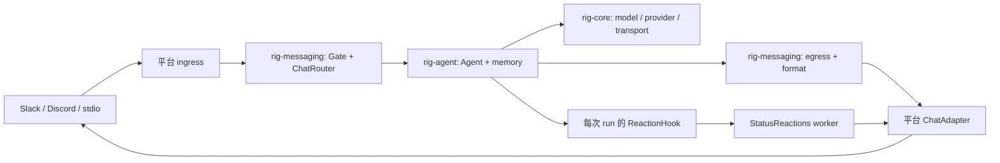

# rig-messaging 架構與行為契約

本文記錄目前實作的組件、資料流與呼叫者責任。使用入口見
[README](README.md)，實作工作拆分見
[rig-messaging-plan.md](../../rig-messaging-plan.md)。修改行為時，應同步更新本文與對應測試。

## 1. 套件邊界

`rig-messaging` 將平台訊息轉交給 `rig-agent::Agent`，並將 Agent 的串流回覆送回平台。
共用套件負責 admission、對話序列化、prompt 組裝、文字分段與狀態 reactions。
平台事件訂閱、驗證、thread 建立、附件下載與 API 呼叫由平台整合負責。



目前平台實作放在 `examples/messaging_*`，共用套件沒有 Slack SDK 或 serenity 依賴。
這讓新增平台能共用相同的 router、egress 與 reactions。

套件依賴 `rig-core`、`rig-agent` 與 Tokio，僅支援 native target。
可直接依賴 `rig-messaging`，或啟用 facade 的 `messaging` feature，透過
`rig::messaging` 使用。該 feature 同時啟用 `agent`；WASM 不會匯出 messaging 模組。

### 原始碼分工

| 模組 | 責任 |
| --- | --- |
| [types.rs](src/types.rs) | 平台地址、原始訊息、回覆目的地與附件 |
| [adapter.rs](src/adapter.rs) | Object-safe `ChatAdapter` 與 `ChatError` |
| [gate.rs](src/gate.rs) | 依原始訊息 metadata 判斷是否接收 |
| [router.rs](src/router.rs) | 每個 conversation 的鎖、prompt 與 Agent run |
| [egress.rs](src/egress.rs) | 串流預覽、terminal outcome 與最終交付，為內部模組 |
| [format.rs](src/format.rs) | Unicode 分段、code fence、thread 標題與預覽尾端 |
| [markdown.rs](src/markdown.rs) | 表格轉成 code block、bullets 或保留原文 |
| [reactions.rs](src/reactions.rs) | 每次 run 的狀態 controller、hook 與 worker |

## 2. 地址與 conversation identity

`ChannelRef` 包含 `platform`、`scope_id`、`channel_id` 與 `thread_id`。
`scope_id` 表示 workspace、guild 或 tenant；`thread_id` 用於頻道內嵌的 thread。
Discord thread 自身就是 channel，因此可使用 thread 的 `channel_id`，並讓 `thread_id` 為 `None`。
Ingress 必須自行設定正確的 `is_thread`，不能只由 `thread_id` 是否存在推導。

`Inbound` 保留兩個不同用途的地址：

| 欄位 | 用途 |
| --- | --- |
| `message: MessageRef` | 原始輸入位置與 message id，供 Gate 與 reactions 使用 |
| `reply_channel: ChannelRef` | 回覆目的地，決定 conversation memory 與鎖的 identity |

平台建立回覆 thread 時，只更新 `reply_channel`。原始 `message`、`is_dm`、
`is_thread` 與 `mentions_bot` 維持輸入時的意義，避免回覆目的地影響 admission 或 reaction 位置。

`reply_channel.session_key()` 是傳給 Agent 的 conversation id。
編碼帶有 `v1:` 前綴，依固定欄位順序使用 UTF-8 byte length；`None` 與 `Some("")` 不同。
例如 stdio 的地址得到 `v1:5:stdio-:5:local-:`。
欄位內的分隔符不會造成地址碰撞。

同一 reply address 的所有使用者共用一份歷史。Sender id 不參與 session key；
不同平台、scope、channel 或 thread 則分開。此 identity 本身不代表資料已持久化。

## 3. Ingress 與 admission

平台 ingress 先將事件整理成 `Inbound`，再呼叫 `router.allows`。
允許後才建立回覆 thread 或執行附件下載，最後呼叫 `router.handle`。
`handle` 會再次檢查 Gate。被拒絕的輸入回傳 `Ok(())`，不建立 reaction worker、
不呼叫 Agent，也不發送回覆。

Gate 的規則如下：

- 永遠拒絕自身 bot 的訊息。
- 預設拒絕其他 bot；`allow_bots = true` 可開放。
- channel allowlist 比對原始 `message.channel.channel_id`。
- user allowlist 比對人類 sender id；允許的其他 bot 不受 user allowlist 限制。
- `None` 或空 allowlist 均表示不限制，並非拒絕全部。
- DM 與原始 thread 訊息不需要 mention。一般頻道訊息需要 mention。

Discord thread channel 不會繼承 parent channel 的 allowlist。
若開啟 channel 限制，後續 thread 訊息的原始 thread channel id 也必須列入。
Slack 的 thread 保留相同 channel id，以 `thread_id` 區分 conversation。

這些規則不取代平台驗證與權限管理。Ingress 仍需判斷 workspace、事件種類、
自身 bot id 與平台提供的 sender metadata。

## 4. Run 與並行生命週期

呼叫者必須提供已設定 `.memory(...)` 或 `.memory_handler(...)` 的 Agent。
共用同一 Agent 與 history backend 的 ingress 應共用一個 `ChatRouter`。

每次 `handle` 依下列順序執行：

1. 檢查 Gate 與 adapter 的正數訊息長度上限。
2. 建立此 run 專用的 `StatusReactions`，等待 queued 狀態處理完成。
3. 取得 reply session key 對應的 conversation mutex，等待鎖。
4. 排程 thinking 狀態，組裝 prompt，啟動附有此 run 的 `ReactionHook` 的 Agent stream。
5. Egress 消費串流、檢查 memory append outcome，並完成最終交付。
6. 依結果等待 done 或 error reaction 處理完成，然後釋放 conversation 鎖。
7. 回收不再使用的鎖；需要移除 reactions 時，在鎖外等待 retention 並清除。

鎖涵蓋 Agent 讀取／追加歷史與最終交付，因此同一 conversation 的下一個 run
不會在上一個 run 尚未完成時使用歷史。不同 conversation 可以並行。
平台 handler 以 task 啟動時，執行順序取決於鎖取得順序，沒有事件到達順序保證。

鎖表使用 `HashMap<String, Arc<Mutex<()>>>`。
取得既有鎖的 Arc 與清理強引用都在鎖表 mutex 內完成；只有鎖表持有最後一份 Arc 時才移除。
這避免清理與新輸入競爭時，同一 conversation 同時出現兩把鎖。
正常成功與失敗都會清理；task abort 可跳過這段流程。

Agent history 的讀取與追加由 `rig-agent` 處理。Router 不自行追加歷史，
也不會從 Slack 或 Discord 的訊息 API 自動重建 history。
平台 read/history API 與模型 conversation memory 是兩個獨立功能。

## 5. Prompt 與附件

文字輸入使用 `[sender name (sender id)]` 前綴，讓共用 thread 的發言者可辨識。
平台 channel、thread 與 session key 不會額外注入 prompt；sender name 與 id 會提供給模型。

`Attachment` 包含 filename、MIME、可選 size 與 `Bytes` 或 `Url` payload。
`ChatConfig::attachment_mime_types` 是精確 MIME allowlist，預設為空。
只有 allowlist 內且 Rig 能辨識的 image、document、audio 或 video MIME，
才轉成對應的 `UserContent`。其餘附件轉成包含檔名與 MIME 的文字說明。

Ingress 負責下載驗證、授權、大小上限、timeout 與失敗說明。
Router 不下載 URL、不檢查 attachment size，也不替 provider 取得私人附件的權限。
同一 MIME 的 bytes 與 URL 都受相同 allowlist 限制；URL 必須能被所選 provider 使用。

## 6. Adapter 與串流交付

`ChatAdapter` 提供 `send`、`edit`、`delete`、`add_reaction` 與 `remove_reaction`。
`send` 回傳真實 `MessageRef`，供後續編輯與刪除使用。
`send_final` 確認最終文字已被平台接受，不要求回傳地址；預設呼叫 `send`。
`edit_final` 預設呼叫 `edit`，原生串流 adapter 可用它關閉 streaming 狀態。
沒有 outbound message id 的平台應停用 preview，實作 `send_final`，並讓 `send`
回傳 `Unsupported`，不能捏造可編輯的訊息地址。
非支援操作使用 `ChatError::Unsupported`；平台失敗使用 `ChatError::Platform`。
非同步方法使用 Rig 的 `WasmBoxedFuture` 與相容 bounds，但套件本身仍僅支援 native。

| 能力 | 預設 | 呼叫者契約 |
| --- | --- | --- |
| `message_limit()` | 實作者提供 | 正數，計算 Unicode scalar values，並符合平台 payload 限制 |
| `supports_edit()` | `true` | 不支援的 adapter 應設為 `false`，停用串流預覽 |
| `supports_reactions()` | `true` | 不支援的 adapter 應設為 `false`，跳過 worker 與 retention |
| `renders_native_tables()` | `false` | `true` 時保留 Markdown 表格，交給平台渲染 |

Adapter 負責 API timeout、平台 id 驗證、格式轉換與 mentions／unfurl 控制。
共用套件沒有平台 API retry、rate-limit scheduler 或持久化 outbound queue。

### 預覽與最終回覆

- 第一個 text delta 建立 `…` placeholder。後續 delta 最多每 1500 ms 觸發一次預覽編輯。
- 預覽保留累積文字的尾端，最終交付使用完整 terminal response，並非預覽 buffer。
- Placeholder 建立失敗會停用預覽；連續三次預覽編輯失敗也會停用。
- 預覽失敗不停止消費 Agent stream。`ModelTurnRetried` 會清空 buffer，並嘗試重設預覽。
- `FinalResponse`、stream error 或 EOF 結束消費。EOF 缺少 terminal item 時回傳 `UnexpectedEnd`。
- 最終內容為空時，發送完成但沒有文字回覆的說明。

最終文字先依 table mode 處理，再按 adapter 上限分段。
分段優先保留行與 grapheme 邊界；code fence 在可容納時關閉並於下一段重新開啟。
若 wrapper 或單個 grapheme 無法容納，使用保持 UTF-8 有效的 scalar 分段，遵守長度上限。
`TableMode` 預設為 `Code`，另有 `Bullets` 與 `Off`；原生表格平台強制使用 `Off`。

第一段優先以 `edit_final` 編輯 placeholder。失敗後嘗試刪除 placeholder，再以
`send_final` 發送替代訊息；
即使刪除失敗也會嘗試發送。其餘段落逐一發送，某段失敗仍會嘗試後續段落。
未刪除的舊 placeholder 或未交付段落都會使結果為 error。

### 歷史與失敗結果

| 情況 | 平台交付 | `handle` 結果 |
| --- | --- | --- |
| Memory acknowledged，最終交付成功 | 完整回覆 | `Ok(())` |
| 預覽失敗，最終交付恢復成功 | 完整回覆 | `Ok(())` |
| Memory append 失敗或沒有 outcome | 回覆加上 history 警告 | `MemoryAppend` 或 `MissingMemory` |
| Stream error 或缺少 terminal item | 嘗試交付錯誤說明 | `Stream` 或 `UnexpectedEnd` |
| 正常 terminal，但最終交付不完整 | 其餘可交付段落仍嘗試送出 | 平台 error |

Memory 失敗不會由 messaging 重試 append。若已存在 stream／memory error，
錯誤通知的交付失敗會記錄，但回傳原本的 stream／memory error。
History 追加與平台交付不是同一個 transaction：歷史可能已成功保存，但平台交付失敗。
呼叫者不能把整個 `handle` 直接重跑視為安全的交付重試。

## 7. Reactions

每次 run 都有獨立的 controller、channel、worker 與 hook。
Hook 僅排程狀態，不等待平台 API，因此 completion、tool 與 text delta 的處理
不會被 reaction 網路往返阻塞。

| 事件／狀態 | 預設 emoji | 行為 |
| --- | --- | --- |
| 等待 conversation 鎖 | 👀 | Queued，開始進度計時 |
| Completion dispatch／reasoning／tool outcome | 🤔 | Thinking |
| Tool dispatch | 🔥／👨‍💻／⚡ | 依名稱分成一般、coding、web；web 優先 |
| 10 秒沒有進度 | 🥱 | Soft stall |
| 30 秒沒有進度 | 😨 | Hard stall |
| 最終交付與 memory 成功 | 🆗 | Done，加一個隨機 mood emoji |
| Run、memory 或交付失敗 | 😱 | Error |

Worker 序列化平台操作，先加新 reaction，再移除舊 reaction。
Progress 更新預設 debounce 700 ms，只套用最後一個待處理狀態。
Text delta 最多每秒更新一次進度計時，不改變目前 emoji。
Queued 等待期間也可能觸發 stall；terminal 後忽略後續進度更新。

Queued、terminal 與 clear 操作會等待 worker acknowledgement。
Reaction API 失敗只記錄 debug log，不改變回覆結果；adapter 的 timeout 仍決定等待時間。
預設保留 terminal 與 mood reactions。啟用 `remove_after_reply` 時，
成功保留 1500 ms、失敗保留 2500 ms，再清除；這段等待不持有 conversation 鎖。

## 8. 現有平台整合

| 整合 | Ingress 與 reply identity | 文字與表格 | 封裝位置 |
| --- | --- | --- | --- |
| [Slack](../../examples/messaging_slack/README.md) | Socket Mode；channel id + thread timestamp；DM 可無 thread | 11,900 scalars；Block Kit Markdown，平台可轉成原生 blocks | Workspace example，使用既有 HTTP／WebSocket transports |
| [Discord](../../examples/messaging_discord/README.md) | Serenity events；mention 建立 thread channel；DM 與既有 thread | 2000 scalars；共用表格轉換 | 獨立 workspace，隔離 serenity 的依賴圖 |
| [stdio](../../examples/messaging_stdio/README.md) | 每行輸入，單一 `stdio/local` conversation，逐行等待完成 | 完成後輸出每段；無 edit 或 reactions | Workspace example，供本機開發 |

Slack 在啟動 Agent task 前 ACK envelope，並保留最近 1024 個原始訊息 identity，
避免 mention/message 訂閱重疊與 reconnect 造成重複處理。此去重資料跨 reconnect，
但不跨 process restart；它不構成 exactly-once 保證。

Slack 僅在 `invalid_blocks` 或 `msg_blocks_too_long` 時改用 plain text 重送。
這個 fallback 保留文字中的 Markdown 表格，不重新套用共用表格轉換；其他 API error 直接回傳。

Slack 與 Discord ingress 將單次輸入的附件下載限制在總計 10 MiB，
同時檢查 metadata、response length 與實際讀取 bytes。
Slack 私人附件的 bearer token 僅用於 HTTPS Slack host。
附件可否交給模型仍由 `ChatConfig` 與模型能力決定。

## 9. 模型 metadata 與 context 預算

模型與 provider 在建構 Agent 時由應用程式選擇。
`rig-messaging` 接收已建好的 Agent，不依平台選模型，也不內建 context 壓縮策略。

| 組件 | 目前位置與責任 |
| --- | --- |
| [ModelsDev](../rig-core/src/model/models_dev.rs) | Rig core，回傳既有 `ModelInfo` 的 context／output limits，下載快取與手動 invalidation |
| Agent、memory 與 hook 機制 | Rig agent，執行模型呼叫與管理 conversation history |
| [Slack provider 配置](../../examples/messaging_slack/src/provider.rs) | 應用層，依 Go endpoint 選 API，建立 Agent 與 `ModelLimits` hook |

`ModelsDev` clones 共用一份記憶體 catalog，併發查詢只下載一次。
成功下載後，其他 provider/model 查詢使用同一份資料；`invalidate().await`
會讓下一次查詢重新下載。失敗不快取，也沒有自動 expiry 或磁碟持久化。
HTTP transport 與 deadline 由呼叫者提供，response 上限為 16 MiB。

Slack 的 Go 範例以 endpoint suffix 分別選擇 OpenAI Chat、OpenAI Responses 或
Anthropic Messages。每個 conversation 的 session key 透過 task-local middleware
帶入 `x-opencode-session`，與其他 conversation 分開。

範例中的 `ModelLimits` hook 以完整 prepared request 的序列化 UTF-8 bytes
加 4096-token margin 估算輸入成本，限制 configured output cap、模型 output cap
與剩餘 context。預算耗盡時拒絕該次模型 dispatch，不刪除歷史。
這不是精確 tokenizer 計數。Metadata 缺失時沿用 configured output cap，預設 4096。
此 hook 目前仍在 Slack 範例，沒有移入 `rig-agent`。

## 10. 擴充與驗證

加入平台時，實作者應完成以下工作：

1. Normalization：保留原始訊息，建立正確 reply identity 與 sender metadata。
2. Ingress：驗證事件，先做 admission，再建立 thread／下載附件；處理 reconnect 與重複事件。
3. Adapter：實作真實平台操作、正數長度上限與能力旗標；設定 timeout 與 mentions 行為。
4. Wiring：將有 memory 的 Agent、Gate、ChatConfig 與共用 router 接上 ingress。
5. Tests：覆蓋 id、admission、副作用順序、附件限制、交付失敗與平台 payload。

平台差異應留在 ingress 與 adapter。若差異真的影響共用行為，再調整契約、
實作與所有受影響的測試。

Core regression tests 位於各模組的 sibling test files，涵蓋 session key、Gate、
鎖清理競爭、共享 history、memory failure、預覽恢復、分段與 concurrent reaction hooks。
平台 offline tests 使用 mock models、local HTTP／WebSocket fixtures，無需憑證。

```sh
cargo nextest run --locked --profile local -p rig-messaging
cargo nextest run --locked --profile local -p messaging_stdio
cargo nextest run --locked --profile local -p messaging_slack
cargo test --locked --manifest-path examples/messaging_discord/Cargo.toml
```

Slack credentialed tests 與環境設定見 [Slack README](../../examples/messaging_slack/README.md)。
它們驗證真實 Web API、Socket Mode、Unicode／表格，以及模型回覆的交付與讀取。
模型／router 測試以合成 sender 事件觸發，輸出走真實 Slack；真人 mention 與 DM
仍屬另外的人工驗收。這些讀取操作是平台測試功能，沒有加入 `ChatAdapter` 的歷史同步 API。

目前沒有 distributed conversation lock、messaging 自有 durable history、
持久化去重／outbox、全域 concurrency 上限、取消 API，或自動 history 壓縮。
示例的 in-memory history、去重與鎖都無法提供多 process 協調。

文字分段與表格轉換沿用 OpenAB 的 MIT 授權實作；授權與來源聲明見
[LICENSE.OpenAB](LICENSE.OpenAB)。
