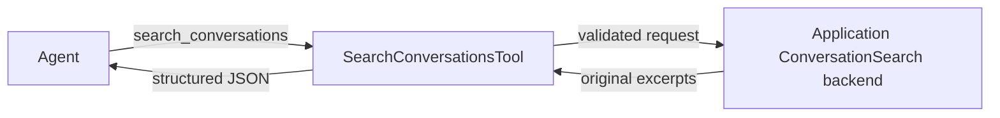

# Conversation search architecture

Rig exposes saved-conversation search through a backend contract and a portable
agent tool. The implementation lives in `rig-core`; the public facade re-exports
it without an additional feature flag. Applications supply the search backend.

## Components

| Component | Responsibility | Implementation |
| --- | --- | --- |
| `ConversationMemory` | Load, append, and clear ordered history for a conversation | [memory.rs](../../crates/rig-core/src/memory.rs) |
| `ConversationSearch` | Search authorized conversations and retrieve original excerpts | [conversation_search.rs](../../crates/rig-core/src/conversation_search.rs) |
| `SearchConversationsTool<S>` | Validate tool arguments, call the backend, and bound result count | [search_conversations.rs](../../crates/rig-core/src/tool/builtin/search_conversations.rs) |
| `PortableTool` to `Tool` adapter | Expose the portable implementation through contextual dispatch | [contextual.rs](../../crates/rig-core/src/tool/contextual.rs) |

`ConversationMemory` and `ConversationSearch` share `ConversationId`. Search
does not call memory automatically or add messages to active history. This
lets a backend retrieve saved originals even when a memory policy filters the
history loaded for the current prompt.

## Request and result contract

`ConversationSearchRequest` has three public fields:

| Field | Type | Contract |
| --- | --- | --- |
| `query` | `String` | Required in JSON; must contain non-whitespace text; forwarded unchanged |
| `limit` | `u32` | Defaults to 5 when omitted from JSON; accepted range is `1..=100` |
| `conversation_id` | `Option<ConversationId>` | Omitted or null means no additional conversation filter |

Deserialization supplies defaults. `validate()` performs the semantic checks;
deserialization alone does not reject a blank query or a limit of zero.
Backends validate direct calls and enforce the limit and conversation filter.
The filter narrows the access scope configured by the application.

`ConversationSearchHit` contains `conversation_id`, a backend-owned `chunk_id`,
the zero-based `start_index`, and `messages: Vec<Message>`. A chunk reference is
stable within its conversation. Messages form a contiguous original excerpt,
retain source order, and preserve complete tool-call/result exchanges. The
backend supplies these guarantees. Results follow backend relevance order;
no matches produce an empty vector. The shared result has no relevance score
or graph-path field.

`ConversationSearchError::InvalidRequest` describes a violated request
constraint. `Backend` retains the original boxed error source. The trait and
future use Rig's WASM-compatible bounds; boxed sources require `Send + Sync`
only on native targets.

## Tool execution

The public constructor is
`rig::tool::builtin::SearchConversationsTool::new(scoped_backend)`.
Its provider-facing name is `search_conversations`. The JSON Schema requires
only `query` and matches the request's defaults, bounds, and nullable filter.
Register it explicitly through the existing agent tool APIs.

Each call validates the request before invoking the backend, forwards it
unchanged, and propagates errors. It preserves returned order and messages,
truncating excess hits to the requested limit. Results become structured JSON
through the existing `IntoToolOutput` implementation, including an empty array
when nothing matches. Result-count limits do not impose a token or byte budget.

## Backend boundary

The backend owns authorization, ranking, excerpt size, and source retrieval.
An application may coordinate `VectorStoreIndex`, [CypherQuery](cypher.md),
and conversation storage behind this contract. Rig currently supplies no
concrete conversation-search backend or automatic index synchronization.
Session persistence, chunk generation, index updates, and token budgets remain
application responsibilities.

## Regression coverage

- [Contract tests](../../crates/rig-core/src/conversation_search/tests.rs)
  cover JSON defaults, validation boundaries, source serialization, generic
  calls, empty results, and error sources.
- [Tool tests](../../crates/rig-core/src/tool/builtin/search_conversations/tests.rs)
  cover schema consistency, validation before invocation, unchanged requests,
  result ordering and limits, structured output, and backend failures.
- [Facade test](../../tests/conversation_search_tool.rs) registers the tool
  with `ToolSet` and executes a JSON request through contextual dispatch.

These tests use mock backends and require no database or model credentials.
