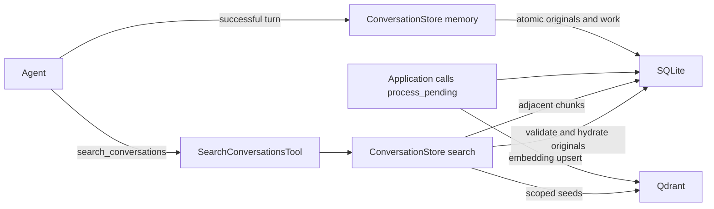

# SQLite and Qdrant conversation storage

`rig-conversation-store` is a native companion crate implementing the existing
`ConversationMemory` and `ConversationSearch` contracts. The facade exposes it
through `rig::conversation_store` with the `conversation-store` feature.
`rig-ladybug` independently implements `CypherQuery` and is available through
`rig::ladybug` with the `ladybug` feature. Core contracts and agent runtime
behavior are unchanged.

## Components

| Component | Responsibility |
| --- | --- |
| SQLite | Original typed messages, adjacent chunk positions, generations, stable UUIDs, and durable indexing progress |
| Qdrant | Cosine embeddings keyed by chunk UUID, filtered by scope and optional conversation ID |
| `ConversationStore` | Scoped memory/search handle and explicit bounded indexing operations |
| `SearchConversationsTool` | Existing portable agent tool around a cloned search handle |

## Persistence and agent integration

Register clones of one opened store as agent memory and the search tool. Existing
agent memory integration loads history and appends successful turns. No new
message interceptor or runtime hook is introduced. Explicit supplied history,
resume paths, and failed turns retain their existing memory behavior.

`append` allocates positions and commits complete serialized `Message` values,
chunk references, and indexing intent in one SQLite transaction. It does not
contact an embedding provider or Qdrant. A completed append batch
forms one contiguous chunk; an unfinished tool exchange remains an unindexed
tail until later appends complete its call/result pairs. Tool IDs use Rig's
typed call identity. Invalid or orphaned exchanges remain stored but unindexed.

Embedding text uses bounded UTF-8 text, tool names/arguments/results, and media
markers. Search returns the saved messages, including their original multimodal
and tool content. Append has no idempotency key; an application retry after an
ambiguous append outcome can duplicate messages.

## Index lifecycle

Applications explicitly call `process_pending(max_jobs)`. Each finite batch
holds the shared projection/clear gate, upserts persisted UUIDs, and records
Qdrant acknowledgments. Failures preserve the original
history and pending work. No indexing loop starts automatically. Dropping the
processing future leaves its owned batch running; applications should await
processing before shutting down Tokio.

`index_status()` reports pending work and retained failure information.
`rebuild_indexes()` marks active chunks pending again while retaining UUIDs,
generations, and originals. Applications recreate missing Qdrant collections,
then process this work. Index updates are eventually consistent;
search does not process pending work implicitly.

`clear` waits for the shared gate, advances the authoritative generation,
deletes original messages, and queues projection cleanup. Subsequent hydration
rejects old generations even before external deletion finishes. Re-appending
starts positions at zero with new UUIDs. Cleanup is idempotent and scoped to
the retired generation.

Clones share synchronization. Use one opened store per scope for indexing and
clear; independent opens are not a distributed worker lease. There is no atomic
transaction across the two databases.

## Retrieval and bounds

The request is validated and embedded using the configured model. Qdrant
filters scope before ranking and applies the optional conversation filter.
Candidate paging discards stale references against SQLite and refills within
the configured candidate budget. SQLite retrieves each seed's immediately
adjacent chunks using message positions: a preceding chunk ends at the seed's
start, and a following chunk starts at its end. Both must share its scope,
conversation, and active generation. This lookup does not depend on neighboring
chunks having been indexed in Qdrant.

Seed groups follow vector relevance, with adjacent chunks before the next seed
group. Duplicate IDs are removed. SQLite hydrates complete original chunks in
one read transaction, checking scope, conversation filter, and active generation
again. The backend returns at most the requested number of hits. Complete
serialized hits exceeding the output byte budget are omitted; messages and
tool exchanges are never cut to fit. An empty result is valid. Projection or
embedding outages return typed backend errors.

The output budget bounds the returned JSON. Hydration still reads and
deserializes a complete chunk before checking its size, so it does not bound
temporary allocations. Replacing a same-named Qdrant collection requires an
explicit projection rebuild.

`StoreConfig` binds a scope, model identity, dimension, and bounded query,
embedding, candidate, context-expansion, and output budgets. The persisted
compatibility identity includes chunking version, model descriptor, dimension,
embedding budget and collection. Incompatible identities require
a separate archive and re-appending original history. Query/output budgets may
change on reopen. Qdrant requires a single unnamed cosine vector.

## Entry points and validation

See the [crate README](../../crates/rig-conversation-store/README.md) and
[agent/tool example](../../crates/rig-conversation-store/examples/conversation_search.rs).
The [Ladybug adapter](../../crates/rig-ladybug/README.md) documents parameter and
result conversion and transaction behavior.

SQLite and chunking tests cover durable reopen, configuration checks, concurrent
position allocation, tool pairing, original multimodal values, clear/reappend,
scope isolation, adjacent chunk lookup, index rebuild, and serialized output budgets. Docker-backed
Qdrant tests use deterministic mock embeddings to exercise combined retrieval,
original hydration, indexing retries, tool output, successful and
failed agent turns, and cancellation while clear waits for projection work.
