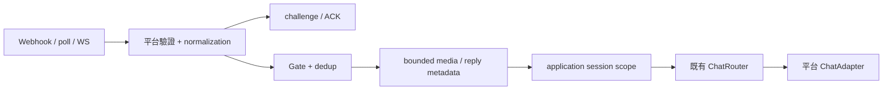

# OpenAB 通訊平台擴充設計

## 目標與範圍

將 OpenAB 已有的七個其他通訊平台接入 Rig：Telegram、LINE、LINE WORKS、
Microsoft Teams、Google Chat、Feishu/Lark、WeCom。既有 Slack 與 Discord 保留。
以實際 adapter／dispatch 為依據，不能只依 schema 宣稱功能存在。
OpenAB 的 iMessage ADR 尚為 Proposed；ACP 是 agent protocol，不列為通訊軟體。

本文的交付範圍是通訊整合：authenticated ingress、sender/conversation identity、
Gate、附件、文字回覆、可用的 thread／edit／delete／reactions、串流與 rich delivery。
OpenAB 的 cron、voice transcription、slash commands、多 bot 協調與應用層工具
另外列入需求對照，不能由平台已接通推論它們已移植；若使用者要求完整功能集合，
應擴充對應 runtime tasks，而不是刪減平台範圍。

目前架構契約見 [CONTRACT](crates/rig-messaging/CONTRACT.md)。本設計不改變既有
original message／reply address、Gate、副作用順序與 memory acknowledgement 契約。

## 可行性與能力差異

七個平台均有可用的接收與回覆協定，因此不存在必須改寫 Agent runtime 的障礙。
難度集中於 OAuth/JWT、encrypted callbacks、token renewal、reply token 生命周期、
Feishu WebSocket protobuf／CardKit。平台本身缺少的功能使用 capability flags
與 `ChatError::Unsupported` 表達，不模擬成同樣的 API 成功。

| 平台 | 參考實作 | 接收與驗證 | 回覆差異與移植重點 |
| --- | --- | --- | --- |
| Telegram | `openab-gateway/src/adapters/telegram.rs` | Webhook secret，可加 long polling | 4096 字元；chat/topic identity；UTF-16 mention offsets；send/edit/delete/reactions；rich drafts 僅 private chat |
| LINE | `openab-gateway/src/adapters/line.rs` | Raw-body HMAC-SHA256 signature | 5000 字元；一次 reply token 與 push fallback；無 edit/delete/reactions/thread；保留真實 reply/push ids |
| LINE WORKS | `openab-gateway/src/adapters/lineworks.rs` | Signed callback，service-account JWT OAuth | user/channel endpoints；10,000 字元；201 ACK 無 message id；token cache + 401 refresh；Flex + text fallback；無 edit/reactions/thread |
| Teams | `openab-gateway/src/adapters/teams.rs` | Bot Connector JWT/JWKS、issuer/audience/tenant/service URL | 真實 activity ids；replyToId；send/update/delete；不能複製 reference 的 edit command 落入 send 行為 |
| Google Chat | `openab-gateway/src/adapters/googlechat.rs` | Google OIDC、audience、issuer 與 Chat signer | 真實 resource ids；space/thread；OAuth 或 GCP service-account impersonation；edit/delete API 可用，bot reactions 不等同 user reactions |
| Feishu/Lark | `openab-gateway/src/adapters/feishu.rs`、`feishu_card.rs` | Verified/encrypted webhook 與 WebSocket protobuf frames | Tenant token cache；DM/thread/post；edit/delete/reactions；CardKit streaming；domain 決定 Feishu 或 Lark |
| WeCom | `openab-gateway/src/adapters/wecom.rs` | SHA1 signature、AES encrypted XML、Corp ID 與 freshness | 自建應用 DM；access token cache；text send／recall；無任意 group/thread/reactions；非 consumer WeChat |

參考路徑均相對於本機唯讀 `reference/openab/crates/`。Schema index 位於
`reference/openab/docs/platforms/`；reference 存在的錯誤、不完整 dispatch 或不安全
fallback 不構成 Rig 的相容要求。

官方協定依據：

- [Telegram Bot API](https://core.telegram.org/bots/api)
- [LINE Messaging API](https://developers.line.biz/en/reference/messaging-api/)
- [LINE WORKS authentication](https://developers.worksmobile.com/en/docs/auth)
- [Bot Connector authentication](https://learn.microsoft.com/en-us/azure/bot-service/rest-api/bot-framework-rest-connector-authentication)
- [Google Chat request verification](https://developers.google.com/workspace/chat/verify-requests-from-chat)
- [Google Chat API](https://developers.google.com/workspace/chat/api/reference/rest)
- [Feishu server APIs](https://open.feishu.cn/document/server-docs/im-v1/message/create)
- [WeCom developer documentation](https://developer.work.weixin.qq.com/document/)

## 實作位置與共用介面

新增 native companion `crates/rig-messaging-platforms`。不同平台各有自己的模組、
constructor、configuration 與 sibling tests。共用層只處理真正相同的 transport、
webhook dispatch、token cache 與 bounded download，避免把平台商業規則塞進 core。
新增 facade optional feature／re-export 與可執行的 `examples/messaging_gateway`。
平台 credential、模型選擇與 listener 綁定由應用程式設定。

既有 `rig-messaging::ChatAdapter` 負責 outbound；新增 `Platform: ChatAdapter`
負責 ingress：

- `bot_id()` 回傳已設定或經平台驗證的自身身份。
- `receive(WebhookRequest)` 驗證 raw request，回傳 challenge／ACK 與 normalized events。
- `prepare(Incoming)` 在 Gate 後執行附件下載與必要的 reply metadata 準備。

`WebhookRequest` 帶 method、headers、query 與 bounded raw bytes。
`Incoming` 帶 `Inbound` 與平台 payload。`WebhookResponse` 帶 HTTP status、body、
content type 與事件。簽章驗證與 challenge 發生於 normalization／dispatch 前。

`Gateway` 共用一個 `ChatRouter` 與 `Arc<dyn Platform>`。HTTP handler 先驗證並 ACK，
再對每個事件檢查 Gate、dedup、prepare，最後啟動 router run。可注入 application
dispatch wrapper，以便 Go 的 per-conversation session scope 沿用 reply session key。
沒有合法 sender identity 的 group event 不能假造人類 id 繞過 user allowlist。

HTTP client 使用既有 Rig reqwest transport；原始 SDK secret、token query 與 Telegram
bot URL 不得出現在 errors／logs。URL 驗證先於 bearer attachment request；
Teams service URL 必須經可信 JWT/service URL policy 驗證，不能從未驗證事件直接使用。
缺少 signature/JWT/mandatory secret 時 fail closed。Token refresh 序列化並在 expiry
前留 margin；401 最多 refresh/retry 一次，不能不斷重送非冪等訊息。

## Phases 與 tasks

### Phase 0：架構基準與需求盤點

- P0.1 提交現有 `rig-messaging` CONTRACT。
- P0.2 核對 reference registry、實作、schema、官方 API，記錄能力與缺口。
- P0.3 提交本文與平台 feature 對照；確認完整 gateway 功能集合是否也在需求內。

### Phase 1：共用平台骨架

- P1.1 建立 companion、typed errors、`Platform`／request／event／response。
- P1.2 共用 HTTP、bounded download、signature helpers、token cache。
- P1.3 Gateway raw-body/body-limit/auth/ACK/Gate/dedup/prepare/run 順序。
- P1.4 模擬 HTTP 與 Agent 驗證拒絕事件無下載／模型副作用、去重、並行與 failure。
- P1.5 Companion／facade wiring 與基本文件；此階段不宣稱任何平台已支援。

### Phase 2：Telegram 與 LINE

- P2.1 Telegram verified webhook、identity、UTF-16 mentions、topics 與 Gate。
- P2.2 Telegram send/edit/delete/reactions、bounded photo/document/audio ingestion，
  long-poll runner 與 native rich/private drafts 的 capability 分支。
- P2.3 LINE HMAC webhook、DM/group/room、native bot mentions、bounded media。
- P2.4 LINE reply token 一次使用與 TTL、push fallback、分段／批次、unsupported flags。
- P2.5 Local HTTP fixtures 跑真實協定、auth、payload 與 router history regression。

### Phase 3：LINE WORKS 與 WeCom

- P3.1 LINE WORKS signed callbacks、JWT OAuth cache／refresh、sender routing。
- P3.2 LINE WORKS user/channel sends、附件與 Markdown/Flex fallback。
- P3.3 WeCom GET challenge、POST signature/AES/XML/Corp ID/freshness、dedup。
- P3.4 WeCom token cache、應用 DM sends、recall 與 bounded image/file ingestion。
- P3.5 Signature tampering、encrypted fixtures、expired token、rejected download tests。

### Phase 4：Teams 與 Google Chat

- P4.1 共用 pinned OIDC/JWKS fetching 與 cached key refresh；claims validation。
- P4.2 Teams tenant/service URL verification、conversation refs、mentions/thread metadata。
- P4.3 Teams token acquisition、真實 activity send/update/delete、attachments。
- P4.4 Google Chat event envelope/signer verification、service-account OAuth、static-token
  與 GCP impersonation auth；space/thread/media normalization。
- P4.5 Google Chat 真實 resource ids、send/edit/delete、space rate-limit handling。
- P4.6 Crypto/JWT fixture + real local HTTP protocol tests；不得繞過 auth 以通過 smoke。

### Phase 5：Feishu/Lark

- P5.1 Tenant token cache、verified/encrypted webhook、challenge、DM/group/thread mentions。
- P5.2 Text/post/reply/edit/delete/reactions，edit-limit 與 rich fallback。
- P5.3 Image/file/audio downloads 先 Gate 後執行，拒絕未授權 URL。
- P5.4 Outbound WebSocket bootstrap/protobuf/fragments/ACK/reconnect 與 listener wiring。
- P5.5 CardKit streaming 與最終內容一致性；可用模式均有 fixtures。
- P5.6 Feishu/Lark domain tests、WS/auth/rate-limit/media/dedup regression。

### Phase 6：可執行整合與交付審核

- P6.1 Gateway example 的平台選擇、env config、listener/poll/WS runner 與 shutdown。
- P6.2 保留 OpenAI 與 OpenCode Go 模型選擇、ModelsDev cache、task-local conversation
  header；model/application policy 不放入 platform adapter。
- P6.3 每平台 README、官方權限／callback 設定、env template、offline/live commands。
- P6.4 更新 CONTRACT、root/crate docs 與能力矩陣；記錄 unsupported 與 reference gaps。
- P6.5 審核每平台 authenticated receive、actual sends、attachments、routing／history、
  capabilities 與 recovery 的真實測試範圍。需要憑證的 live tests 使用 explicit ignored tests。

每個平台完成可編譯且有相應測試的階段後 commit；只納入該階段的檔案。
不提交 reference、credentials、live service URLs 或生成的 release documents。

## 驗證與完成條件

使用最小 package/filter 的 `cargo nextest run --locked --profile local`，
同 target 的 Cargo 檢查序列執行；新增 fallible API 遵守 typed errors、相容 bounds
與 sibling test layout。不可用 stub、假成功或 mock-only transport 宣稱實作完成。

每個平台必須有可執行 ingress 與真實 outbound HTTP serialization；offline fixtures
至少驗證 valid／invalid authentication、identity/session keys、Gate-before-media、
message bounds、unsupported capability、actual ids、token expiry 與平台 error propagation。
LINE WORKS 的 send API 回傳 201 而沒有 message id，因此只確認最終發送成功；
`send_final` 支援無地址的 acknowledgement，`send` 不捏造 message id。
WS/poll/encryption/CardKit 等平台模式還需其對應 transport fixtures。

Live credentials 與公開 callback 是線上驗收條件；缺少它們不阻止完整的實作與離線驗證，
也不能將離線成功說成線上成功。不得自動傳送到未指定的外部帳號／頻道。

## OpenAB gateway feature 對照

Reference schema 有 17 項功能：send_message、message_split、streaming、reply_quote、
edit_message、delete_message、emoji_reactions、threads_topics、media_inbound、voice_stt、
trust_gate、deny_echo、mention_gating、slash_commands、multibot、group_routing、cron_dispatch。
其中平台消息能力逐平台落實；voice_stt／slash_commands／multibot／cron_dispatch
涉及另外的應用層 runtime，而 deny_echo 與目前 Gate silent rejection 契約不同。
需求若包含這些項目，必須明確設計，不能為「全部支援」沿用 silent no-op。
